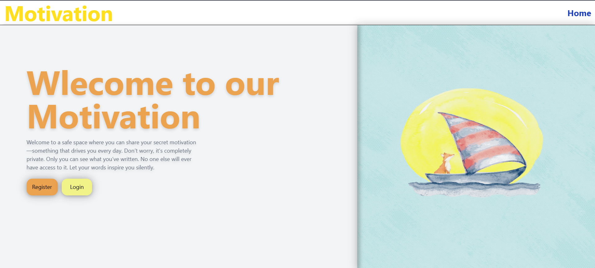
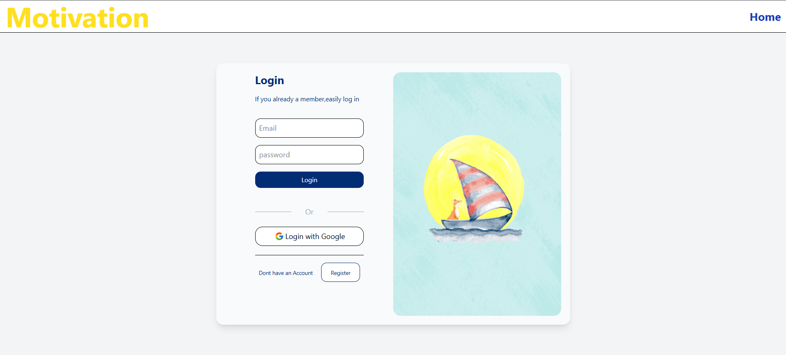
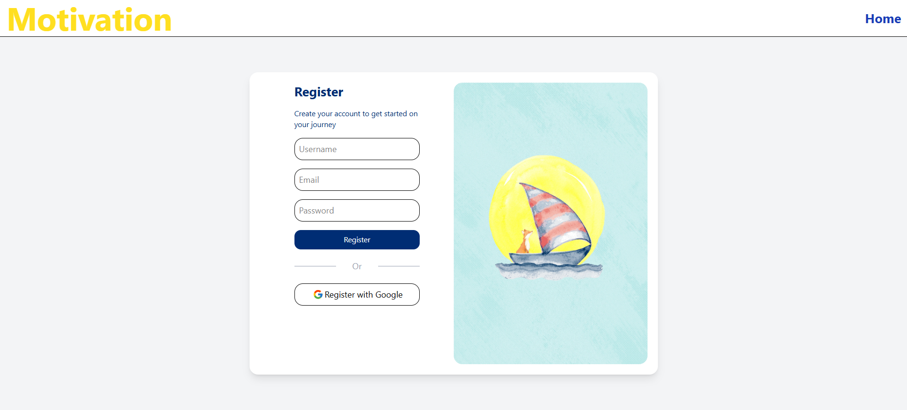
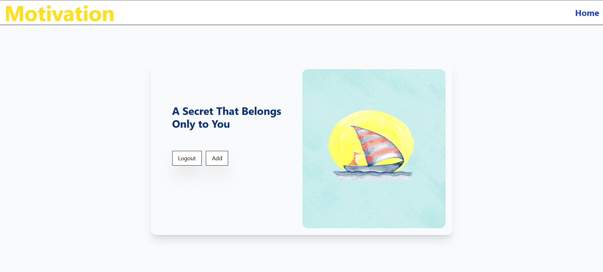

# Login_register-Oauth
A full-stack authentication app using Node.js, Express, Passport.js (Local &amp; Google OAuth), PostgreSQL, and EJS. Users can register, login, and share motivational quotes securely.

# Motivation App

This is a personal project I built to understand how authentication works in web apps. It allows users to register or log in using their email and password, or sign in using Google. Once logged in, they can share motivational quotes. It uses sessions to keep users logged in securely.

This app helped me get practical experience with Passport.js, working with PostgreSQL, and setting up Tailwind CSS with EJS templates.

---> Screenshots <---

-o 🏠 Home Page
The landing page with a clean UI introducing the app and buttons to Register or Login.

-o 🔐 Login Page
Users can securely login using their credentials or continue with Google OAuth.

-o 📝 Register Page
New users can create an account by entering their name, email, and password.

-o 💬 Secrets / Motivation Page
Authenticated users can submit and view their motivational messages privately.

----->Features<-------

- User registration with encrypted passwords (bcrypt)
- Login via email/password or Google OAuth
- Session-based authentication
- Submit motivational quotes
- View all submitted quotes
- Simple and responsive UI using Tailwind CSS

->Tech Stack

- Node.js
- Express.js
- PostgreSQL
- Passport.js (Local & Google strategies)
- bcrypt
- EJS templating
- Tailwind CSS

--> Setup Instructions

1. Clone the Repository
git clone https://github.com/your-username/motivation-app.git
cd motivation-app

2. Install Dependencies
npm install

3. Setup PostgreSQL
Create a database (e.g., auth_db)
Inside it, create a users table:
  CREATE TABLE users (
    id SERIAL PRIMARY KEY,
    name TEXT,
    email TEXT UNIQUE,
    password TEXT

  );

4. Configure Environment Variables
Create a .env file in the root directory:
PORT=3000
DATABASE_URL=your_postgres_connection_string
SESSION_SECRET=your_session_secret
CLIENT_ID=your_google_client_id
CLIENT_SECRET=your_google_client_secret

5. Set Up Tailwind CSS (for EJS)
   
  1-Install Tailwind via npm:
    npm install -D tailwindcss
    npx tailwindcss init
    // Here there is no need of config.js in tailwindd coz its tailwind v4..View documentaion

  2-Build your CSS (this generates output.css):
    npx tailwindcss -i ./public/css/input.css -o ./public/css/output.css --watch

6.Start the Server
  node index.js

📌 ---> Notes <----
Google OAuth requires setting the Authorized redirect URI in Google Cloud Console to:
http://localhost:3000/auth/google/imp

--->Why I Made This
I wanted to understand how real apps manage login and sessions, especially using Passport.js. This project helped me learn full-stack authentication and how frontend, backend, and database work together in a secure way.
After this evrything is Done...But there are improvments to be done..Will improve..
There’s still room to improve — and I’ll keep working on it. But for now, this project represents a solid milestone in my web development journey!

 --> Future Improvements <--
- Add validation for input fields
- Use flash messages for login/register errors
- Improve error handling
- Add profile pictures from Google login
- Deploy the app online (Render/Vercel)

